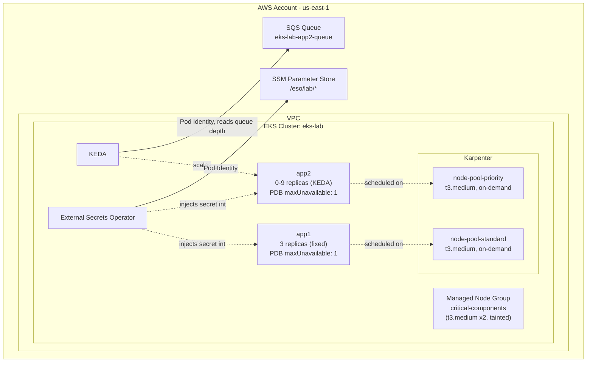

# AWS EKS Autoscaling Lab

A personal, hands-on AWS EKS lab built to go past "click-ops tutorial" level and into the parts that actually break in practice: dual-axis autoscaling (pod-level via KEDA, node-level via Karpenter), least-privilege AWS auth via EKS Pod Identity, cost guardrails, and the debugging that happens when documentation and reality disagree.

Everything here is provisioned by Terraform and plain Kubernetes manifests, applied by a single `bootstrap.sh` script.

## Why this exists

Most EKS tutorials stop at "deploy nginx and call it done." This lab intentionally goes further: two isolated node pools with different disruption policies, a workload that scales on a combination of a cron schedule *and* real SQS queue depth, and infrastructure sized specifically so that a pod-scaling event also forces a node-scaling event - so both autoscalers can be watched reacting together, not in isolation.

## Architecture



Two Karpenter `NodePool`s exist instead of one generic pool, on purpose: `node-pool-standard` (label `standard-node`, taint `standard-taint`) hosts `app1`, and `node-pool-priority` (label `priority-node`, taint `priority-taint`) hosts `app2`. Splitting them means each pool can carry its own disruption/consolidation policy and its own blast-radius budget, and workloads can't accidentally land on the wrong pool.

## Components

| Path | What it is |
|---|---|
| `terraform-eks-infra/` | VPC, EKS cluster, Karpenter (IAM + node pools support), KEDA (Helm release + Pod Identity), ESO IAM role, `app2`'s SQS queue + IAM role |
| `k8s-gitops-manifests/karpenter/` | `EC2NodeClass` + `NodePool` definitions for both pools |
| `k8s-gitops-manifests/eso/` | `ClusterSecretStore` + `ExternalSecret` pulling from SSM Parameter Store |
| `k8s-gitops-manifests/app1/` | Static 3-replica deployment + PDB, consumes the ESO-managed secret |
| `k8s-gitops-manifests/app2/` | KEDA-scaled deployment + `ScaledObject`/`TriggerAuthentication` + PDB |
| `helm/` | Helm values for the ESO and Karpenter charts |
| `bootstrap.sh` | End-to-end: `terraform apply`, Karpenter CRDs/controller, node pools, ESO, both apps |

## Key design decisions

- **EKS Pod Identity over IRSA, everywhere.** ESO, KEDA, and `app2` all authenticate to AWS via Pod Identity Associations instead of IRSA's OIDC-annotation dance - one less moving part, and the pattern that AWS is pushing new workloads toward.
- **Combined Cron + SQS KEDA trigger on `app2`.** A cron trigger guarantees at least 1 replica during "business hours" (08:00-20:00 Europe/Belgrade), while an SQS trigger reacts to actual queue depth on top of that. KEDA combines multiple triggers as OR (max of each trigger's desired replica count), so the two policies layer cleanly instead of fighting each other.
- **`app2` is deliberately sized to co-force Karpenter scaling.** Each pod requests `500m`/`900Mi`, chosen so exactly 3 pods fit on one `t3.medium` (~1930m/~3292Mi allocatable). With `maxReplicaCount: 9`, a full scale-up needs 3 nodes - so sending SQS messages exercises KEDA (pod count) and Karpenter (node count) at the same time instead of one masking the other.
- **PDBs use `maxUnavailable: 1`, not `minAvailable`.** Simpler mental model, but it's a conscious trade-off: when only one replica is up (e.g. `app2`'s cron-guaranteed baseline), `maxUnavailable: 1` still permits evicting that single pod. `minAvailable: 1` would protect it, at the cost of blocking node drains whenever the workload is scaled down. For this lab, simplicity won.
- **Cost guardrails on both NodePools:** hard `cpu`/`memory` limits (~5 nodes worth), on-demand only (no Spot, for predictability over savings), a 14-day forced node expiry, and a scheduled weekly window that blocks empty/underutilized consolidation except for a 2-hour Tuesday-morning gap.

## Real-world debugging notes

The most useful part of this repo isn't the happy path - it's what broke and how it got diagnosed:

- **KEDA's `aws-eks` Pod Identity provider is a dead end.** Setting `TriggerAuthentication.spec.podIdentity.provider: aws-eks` (the name that intuitively matches "EKS Pod Identity") instead throws `error parsing SQS queue metadata: awsAccessKeyID not found`. Reading KEDA's own source (`pkg/scalers/aws/aws_common.go`) showed why: only `provider: aws` is wired to the native Pod Identity/IRSA code path - `aws-eks` is a legacy branch that still expects static credentials. Diagnosed by going from operator logs straight to the upstream Go source, not by trial and error.
- **A Pod Identity Association doesn't retroactively fix a running pod.** The KEDA operator pod had already been scheduled before Terraform created its `aws_eks_pod_identity_association`, so it never got the AWS credential environment variables the EKS Pod Identity webhook injects at pod *creation* time. Fix: `kubectl rollout restart deployment keda-operator`.
- **New AWS accounts have a real, low vCPU ceiling.** Testing Karpenter's multi-node scale-out hit the default "Running On-Demand Standard instances" quota of 8 vCPUs - already fully consumed by the existing managed node group + both NodePools' baseline nodes. A quota increase request was submitted and denied ("ramp up usage first, reapply next billing cycle"), and checking the equivalent Spot quota showed the same ceiling. Documented as a known, external limitation rather than papered over.

## Current status

| Area | Status |
|---|---|
| VPC, EKS cluster, IAM | Done |
| Karpenter (2 NodePools, cost guardrails) | Done |
| External Secrets Operator | Done |
| `app1` (static, ESO-backed) | Done |
| `app2` + KEDA (Cron + SQS `ScaledObject`) | Done |
| PodDisruptionBudgets | Done |
| Live Karpenter multi-node scaling test | Blocked on AWS account vCPU quota (see above) |
| Kustomize | Deliberately skipped - not a prerequisite for ArgoCD, and low value for a single-cluster lab |
| ArgoCD / GitOps | Next |
| CI (`terraform fmt`/`validate`, `tflint`, manifest linting) | Planned |

## Running it

Prerequisites: an AWS account, the AWS CLI configured with a profile that has sufficient permissions, Terraform, `kubectl`, and Helm.

```bash
cd terraform-eks-infra
# bootstrap.sh assumes an AWS CLI profile named "privatni" - change AWS_PROFILE at the top of the script to your own
./bootstrap.sh
```

This runs, in order: `terraform apply` (VPC/EKS/Karpenter/KEDA/IAM), Karpenter `NodePool`/`EC2NodeClass` manifests, the External Secrets Operator install and its `ClusterSecretStore`/`ExternalSecret`, then `app1` and `app2` (deployment, `PodDisruptionBudget`, and `app2`'s `ScaledObject`).

To exercise `app2`'s autoscaling once it's deployed:

```bash
for i in $(seq 1 45); do
  aws sqs send-message \
    --queue-url https://sqs.us-east-1.amazonaws.com/<your-account-id>/eks-lab-app2-queue \
    --message-body "test-$i" --profile <your-profile> --region us-east-1
done
```

## Known limitations

- The `app1`/`app2` containers are placeholder `alpine:latest` (`sleep infinity`) - the point of this lab is the platform plumbing (autoscaling, secrets, IAM), not the application logic.
- `k8s-gitops-manifests/app2/scaledobject-app2.yaml` has this lab's AWS account ID baked into the SQS queue URL. That's not a secret (account IDs show up in every ARN and CloudTrail entry regardless), just swap it for your own if you reuse this manifest.
- The live "Karpenter scales to 3 nodes" test is code-complete but unverified end-to-end, pending the AWS quota increase described above.
